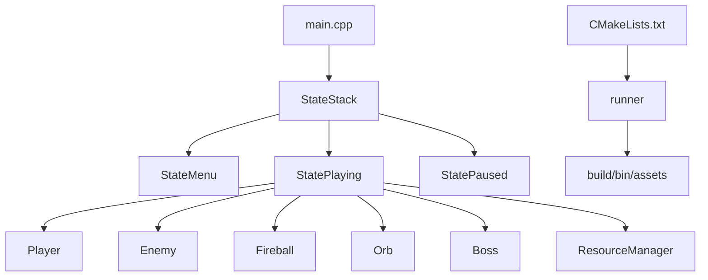

# Runes of Fire

### 🔥 2D Endless Runner (C++ / SFML)

Runes of Fire is a 2D endless runner where you control a sorceress, survive waves of enemies, collect orbs, and invoke a final boss fight.

This repository is part of my gameplay programming portfolio and focuses on core gameplay systems, combat, collision handling, and state-driven game flow.

## ✨ Quick Facts

- 💻 **Language:** C++17
- 🎮 **Graphics/Audio:** SFML 3
- 🛠️ **Build system:** CMake 3.22.1+
- 🚀 **Executable name:** `runner`

---

## 🎯 Gameplay Highlights

- 👾 Endless enemy pressure with timed spawning
- 🏃 Movement model with acceleration, friction, jump physics, and bounds
- 🔥 Charged fireball combat (`hold Space` to charge, `release` to fire)
- 🟣 Orb-based progression (collect `10/10` orbs to unlock boss summon)
- 🧟 Boss encounter with health-based defeat condition
- 🧭 HUD feedback for orb count, summon prompt, and win state

## ⚙️ Systems Implemented

- 🎮 Input pipeline for movement, jump, attack charge/release, pause, and boss invocation
- 💥 Collision systems:
  - player ↔ enemy (death condition)
  - fireball ↔ enemy (damage/kill + orb drop)
  - player ↔ orb (collection)
  - fireball ↔ boss (damage/defeat + win flow)
- 🔁 Entity lifecycle updates for player, enemies, projectiles, orbs, and boss
- 🧱 Game-state architecture (`Menu`, `Playing`, `Paused`)

## 🏗️ Visual Architecture



```text
src/
├── main.cpp
├── ResourceManager.h / ResourceManager.cpp
├── entities/
│   ├── Entity
│   ├── Player
│   ├── Enemy
│   ├── Fireball
│   ├── Orb
│   └── Boss
└── gamestates/
    ├── IState
    ├── StateMenu
    ├── StatePlaying
    ├── StatePaused
    └── StateStack
```


## 🧰 Installation & Run

### 1) Requirements

- CMake `3.22.1+`
- A C++17 compiler (`g++`, `clang++`, or MSVC)
- Git (for fetching dependencies)

> SFML is fetched automatically by CMake (`FetchContent`), so no manual SFML install is required for this project.

### 2) Linux prerequisite packages (Debian/Ubuntu)

Install SFML runtime dependencies:

```bash
sudo apt update
sudo apt install -y \
  libxrandr-dev \
  libxcursor-dev \
  libudev-dev \
  libfreetype-dev \
  libopenal-dev \
  libflac-dev \
  libvorbis-dev \
  libgl1-mesa-dev \
  libegl1-mesa-dev
```

### 3) Configure & build

```bash
cmake -B build
cmake --build build
```

### 4) Run

```bash
./build/bin/runner
```

If you are using a multi-config generator (for example Visual Studio), run the binary from the matching config folder, e.g. `build/bin/Debug/runner`.

---


## 🎮 Controls

| Key | Action |
|---|---|
| `Left / Right` or `A / D` | Move |
| `Up` or `W` | Jump |
| `Space` (hold) | Charge fireball |
| `Space` (release) | Fire charged projectile |
| `F` | Invoke boss (when orbs are `10/10`) |
| `Enter` | Start game / Pause / Unpause |
| `Esc` | Quit |

---


## 📝 Project Notes

- Assets are copied automatically into the executable output directory after build.
- Music, textures, and fonts are loaded through the resource manager layer.

## 📄 Attribution & Ownership

This project was developed from a starter codebase provided during a Supercell gameplay programming challenge.

- The original starter framework and any challenge-provided content remain the property of their respective owners.
- Background music used in this project is the track `Gore.mp3` by Marshall Anderson for the game *Soldat* and is not my original work.
- My contribution in this repository is the gameplay implementation and extension work built on top of that base.
- This repository is shared for portfolio and learning purposes.
